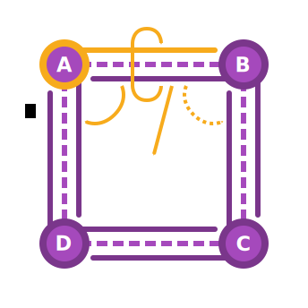

Plexus provides a flexible representation of meshes as a [half-edge
graph](https://en.wikipedia.org/wiki/doubly_connected_edge_list) via the `graph`
module and `MeshGraph` type. Graphs can store arbitrary geometric data
associated with any topological structure. Unlike iterator expressions and
buffers, graphs provide efficient traversals and complex manipulation of meshes.

!!! note
    Plexus refers to _half-edges_ as _arcs_. This borrows from graph theory,
    where _arc_ typically refers to a directed adjacency.

`MeshGraph`s can be created from [buffers](../buffers) and
[generators](../generators).

```rust
// Create a graph of a two-dimensional quadrilateral from raw buffers.
let mut graph = MeshGraph::<Point2<N64>>::from_raw_buffers(
    vec![Tetragon::new(0usize, 1, 2, 3)],
    vec![(0.0, 0.0), (1.0, 0.0), (1.0, 1.0), (0.0, 1.0)],
)
.unwrap();

// Create a graph with positional data from a unit cube.
let mut graph = Cube::new()
    .polygons::<Position<Point3<N64>>>()
    .collect<MeshGraph<Point3<N64>>>();
```

## Representation

A `MeshGraph` is conceptually composed of _vertices_, _arcs_, _edges_, and
_faces_. The figure below summarizes the connectivity in a `MeshGraph`.



Arcs are directed and connect vertices. An arc that is directed toward a vertex
$A$ is an _incoming arc_ with respect to $A$. Similarly, an arc directed away
from such a vertex is an _outgoing arc_. Every vertex is associated with exactly
one _leading arc_, which is always an outgoing arc. The vertex toward which an
arc is directed is the arc's _destination vertex_ and the other is its _source
vertex_.

Every arc is paired with and connected to an _opposite arc_ with an opposing
direction. Given an arc from a vertex $A$ to a vertex $B$, that arc will have an
opposite arc from $B$ to $A$. Such arcs are typically notated
$\overrightarrow{AB}$ and $\overrightarrow{BA}$. Together, these arcs form an
_edge_, which is not directed. An edge and its two arcs are together called a
_composite edge_.

Arcs are connected to their neighbors, known as _next_ and _previous arcs_. A
traversal along a series of arcs is a _path_. The path formed by traversing from
an arc to its next arc and so on is a _ring_. When a face is present within a
ring, the arcs will refer to that face and the face will refer to exactly one of
the arcs in the ring (its leading arc). An arc with no associated face is known
as a _boundary arc_. If both of an edge's arcs are boundary arcs, then that edge
is an _unbounded edge_.

A path is _closed_ if it forms a loop and is _open_ if it terminates. A path
over vertices $A$, $B$, and $C$ is notated $\overrightarrow{\{A, B, C\}}$.

Together with vertices and faces, the connectivity of arcs allows for efficient
traversals of topology. For example, it becomes trivial to find neighboring
topologies, such as the faces that share a given vertex or the neighboring faces
of a given face.

!!! warning
    The `MeshGraph` data structure has some limitations. Only
    [orientable](https://en.wikipedia.org/wiki/orientability) compact
    [manifolds](https://en.wikipedia.org/wiki/surface_(topology)) can be
    represented. Unorientable manifolds such as [Möbius
    strips](https://en.wikipedia.org/wiki/m%C3%B6bius_strip) and non-manifold
    structures such as edge fans cannot be modeled using `MeshGraph`.

`MeshGraph`s store topological data using associative collections and mesh data
is accessed using keys into this storage. Keys are exposed as strongly typed and
opaque values, which can be used to refer to a topological structure.

## Geometry

`MeshGraph` exposes a type parameter that determines the representation of
geometry in a graph. This type must implement the `GraphGeometry` trait, which
specifies which types are used for geometry in vertices, arcs, edges, and faces.

```rust
pub struct Vertex {
    pub position: Point3<R64>,
    pub normal: Vector3<R64>,
}

impl GraphGeometry for Vertex {
    type Vertex = Self;
    type Arc = ();
    type Edge = ();
    type Face = ();
}

let mut graph = MeshGraph::<Vertex>::new();
```

!!! note
    Most examples on this page use the `N64` and `R64` types from the
    [`decorum`](https://crates.io/crates/decorum) crate and the `Point2` and
    `Point3` types from the [`nalgebra`](https://crates.io/crates/nalgebra)
    crate for graph geometry. When the `geometry-nalgebra` feature is enabled,
    these types implement `GraphGeometry`.

The associated types specified by a `GraphGeometry` implementation determine the
type of the `geometry` member exposed by [views](../graphs/#topological-views).
When set to `()`, no geometry is present.

Geometry is vertex-based, meaning that geometric operations depend on vertex
geometry exposing some notion of positional data via the `AsPosition` trait. If
geometry does not have this property, then geometric operations will not be
available. Read more about geometric traits and spatial operations
[here](../geometry).

## Topological Views

`MeshGraph`s expose _views_ over their topological structure (vertices, arcs,
edges, and faces). Views are obtained using keys or iteration and behave
similarly to references. They provide the primary API for interacting with a
`MeshGraph`'s topology and geometry. There are three types of views summarized
below:

| Type      | Traversal | Exclusive | Geometry  | Topology  |
|-----------|-----------|-----------|-----------|-----------|
| Immutable | Yes       | No        | Immutable | Immutable |
| Mutable   | Yes       | Yes       | Mutable   | Mutable   |
| Orphan    | No        | No        | Mutable   | N/A       |

_Immutable_ and _mutable views_ behave similarly to references: immutable views
cannot mutate a graph and are not exclusive while mutable views may mutate both
the geometry and topology of a graph but are exclusive. This example uses a view
to traverse a graph:

```rust hl_lines="15 16 17 18 19 20"
type E3 = Point3<N64>;

// Create a graph with positional and normal data from a unit cube.
let cube = Cube::new();
let mut graph = primitive::zip_vertices((
    cube.polygons::<Position<E3>>(),
    cube.polygons::<Normal<E3>>(),
))
.map_vertices(|(position, normal)| Vertex::new(position, normal))
.collect::<MeshGraph<Vertex>>();

// Get a view of a face and its opposite face.
let face = graph.faces().nth(0).expect("cube");
let opposite = face
    .into_arc()
    .into_opposite_arc()
    .into_next_arc()
    .into_next_arc()
    .into_opposite_arc()
    .into_face()
    .expect("cube");
```

_Orphan views_ are similar to mutable views in that they may mutate the geometry
of a graph, but they do not have access to the topology of a graph. Because they
do not know about other vertices, arcs, etc., orphan views cannot traverse a
graph in any way. These views are most useful for modifying the geometry of a
graph and, unlike mutable views, are not exclusive. Iterators over topological
structures in a graph sometimes emit orphan views.

```rust hl_lines="7 8 9"
// Create a graph with positional data from a UV-sphere.
let mut graph = UvSphere::new(8, 8)
    .polygons::<Position<Point3<f64>>>()
    .collect_with_indexer::<MeshGraph<Point3<f64>>, _>(LruIndexer::default());

// Scale the position data in all vertices.
for mut vertex in graph.orphan_vertices() {
    vertex.geometry *= 2.0;
}
```

Immutable and mutable views are both represented by view types, such as
`FaceView`. Orphan views are represented by orphan view types, such as
`OrphanFaceView`.

## Traversals

There are two types of direct traversals exposed by views: _consuming
traversals_ and _borrowing traversals_. Consuming traversals consume a view and
emit another view. Borrowing traversals only borrow a view and use that borrow
to construct another view. Borrowing traversals only expose immutable views with
a limited lifetime while consuming traversals expose views with the same
lifetime and mutability.

```rust
// Get a mutable view of a vertex in a graph.
let vertex = graph.vertex_mut(key).unwrap();

let arc = vertex.into_outgoing_arc(); // Consumes `vertex`. `arc` is mutable.
let opposite = arc.opposite_arc(); // Borrows `arc`. `opposite` is immutable.
```

Consuming traversals are named like conversions and borrowing traversals are
named like accessors. For example, `into_outgoing_arc` is consuming and
`outgoing_arc` is borrowing.

!!! note
    Only consuming traversals can emit mutable views and when such a traversal
    fails the originating view is lost. The `with_ref` function can be used to
    perform a fallible traversal that maintains mutability and yields the
    originating view upon failure.

## Iterators and Circulators

Topological views allow for traversal of a graph's topology. One useful type of
traversal uses a _circulator_, which is a type of iterator that examines the
neighbors of a topological structure. For example, the face circulator of a
vertex yields all faces that share that vertex in order.

```rust
for face in vertex.neighboring_faces() {
    for arc in face.interior_arcs() {
        // ...
    }
}
```

`MeshGraph`s also directly expose topological structures via iterators, but
without a deterministic ordering. Mutable iterators (including circulators) emit
orphan views, because mutable views require exclusive access. To mutate topology
using multiple mutable views, use an immutable circulator to collect the keys of
the target topology and then lookup each mutable view using those keys.

```rust hl_lines="7 8 9 10"
// Create a graph with positional data from a unit cube.
let mut graph = Cube::new()
    .polygons::<Position<Point3<N64>>>()
    .collect::<MeshGraph<Point3<N64>>>();

// Collect the keys of the faces in the graph.
let keys = graph
    .faces()
    .map(|face| face.key())
    .collect::<ArrayVec<[_; 6]>>();
for key in keys {
    // Get a mutable face view for each key.
    // Poke each face and translate the centroid along the face's normal.
    let _ = graph.face_mut(key).expect("independent").poke_with_offset(0.5);
}
```

Circulators generally begin iteration from a leading arc and then traverse
topology in a deterministic order from that arc.

## Topological Mutations

Mutable views expose topological mutations that alter the structure of a graph.
These operations are always consuming, because they often invalidate the view
that initiates them.

Most mutations return a view over a modified or newly inserted topological
structure that can be used to further traverse the graph. For example, splitting
an arc $\overrightarrow{AB}$ returns a vertex $M$ that subdivides the composite
edge. The leading arc of $M$ is $\overrightarrow{MB}$ and is a part of the same
ring as the initiating arc.

```rust
let vertex = arc.split_at_midpoint(); // Consumes `arc`. `vertex` is mutable.
```

It is possible to downgrade mutable views into immutable views using `into_ref`.
This can be useful when performing topological mutations, as it allows for any
number of traversals immediately after the mutation is performed.

```rust hl_lines="2"
// Split an arc and use `into_ref` to get an immutable view.
let vertex = arc.split_at_midpoint().into_ref();

// `vertex` is immutable and implements `Copy`.
let source = vertex
    .into_outgoing_arc()
    .into_previous_arc()
    .into_source_vertex();
let destination = vertex.into_outgoing_arc().into_destination_vertex();
let span = (source, destination);
```

Graphs also expose aggregate mutations that may operate over any and all
topological structures.

```rust hl_lines="10"
type E3 = Point3<N64>;

let cube = Cube::new();
let mut graph = primitive::zip_vertices((
    cube.polygons::<Position<E3>>(),
    cube.polygons::<Normal<E3>>(),
))
.collect::<MeshGraph<Vertex>>();

graph.triangulate(); // Triangulates all faces in the graph.
```

Topological mutations expose spatial functions for types that implement
geometric traits, such as `split_at_midpoint`. Views also expose purely
topological functions, which can always be used (even if the geometry is
non-spatial).

```rust hl_lines="16"
pub enum Weight {}

impl GraphGeometry for Weight {
    type Vertex = f64;
    type Arc = ();
    type Edge = ();
    type Face = ();
}

let mut graph = MeshGraph::<Weight>::from_raw_buffers(
    vec![Trigon::new(0usize, 1, 2)],
    vec![1.0, 2.0, 0.5],
)
.expect("triangle");
let key = graph.arcs().nth(0).expect("triangle").key();
let vertex = graph.arc_mut(key).unwrap().split_with(|| 0.1);
```

In the above example, `split_with` accepts a function that returns geometry for
the subdividing vertex of the split. Similar functions exist for other
topological mutations as well, such as `poke_with`.

## Computation vs. Payload

When graph geometry implements geometric traits, views expose methods to compute
related attributes like normals and centroids.

```rust
let (graph, _) = MeshGraph::<Point3<f64>>::from_ply(
    PositionEncoding::default(),
    File::open("teapot.ply").unwrap(),
)
.unwrap();

// Computes the centroid of the face.
let centroid = graph.faces().nth(0).unwrap().centroid();
```

These computations are based on the positional data in vertices. However, it is
also possible to include these attributes in the geometry (payload) of a graph
and assign arbitrary values as needed. For example, it is sometimes desirable to
establish vertex normals independently of surrounding face or edge geometry.

```rust
pub struct Vertex {
    pub position: Point3<R64>,
    pub normal: Vector3<R64>,
}

impl GraphGeometry for Vertex {
    type Vertex = Self;
    type Arc = ();
    type Edge = ();
    type Face = ();
}

let mut graph = Cube::new()
    .polygons::<Position<Point3<N64>>>()
    .map_vertices(|position| Vertex {
        position,
        normal: Unit::x(),
    })
    .collect<MeshGraph<Vertex>>();

// Write arbitrary data to the payload.
let mut vertex = graph.orphan_vertices().nth(0).unwrap();
vertex.geometry.normal = Unit::z();
```

The above example uses the `Vertex` type to store a position and normal in each
vertex. This is distinct from computed attributes, as this normal is arbitrary
and is not recomputed when it is accessed. Applications may choose either
approach, though computation is typically preferable.

## Generic Programming

The `graph` module provides traits that express the geometric capabilities of a
`MeshGraph`. These can be used to write generic code that requires particular
geometric operations, such as computing edge midpoints. This example subdivides
a face in a mesh by splitting arcs at their midpoints:

```rust hl_lines="3 4"
pub fn circumscribe<G>(face: FaceView<&mut MeshGraph<G>, G>) -> FaceView<&mut MeshGraph<G>, G>
where
    G: EdgeMidpoint<Midpoint = VertexPosition<G>> + GraphGeometry,
    G::Vertex: AsPosition,
{
    // Split each edge, stashing the vertex key and moving to the next arc.
    let arity = face.arity();
    let mut arc = face.into_arc();
    let mut splits = SmallVec::<[_; 4]>::with_capacity(arity);
    for _ in 0..arity {
        let vertex = arc.split_at_midpoint();
        splits.push(vertex.key());
        arc = vertex.into_outgoing_arc().into_next_arc();
    }
    // Split faces along the vertices from each arc split.
    let mut face = arc.into_face().unwrap();
    for (a, b) in splits.into_iter().perimeter() {
        face = face.split(ByKey(a), ByKey(b)).unwrap().into_face().unwrap();
    }
    // Return the terminating face of the decomposition.
    face
}
```

These traits avoid the need to specify very complex type bounds, but it is also
possible to express type bounds directly using traits from the
[`decorum`](https://crates.io/crates/decorum) and
[`theon`](https://crates.io/crates/theon) crates.

The following example expresses type bounds for a function that computes the
area of faces in two-dimensional graphs:

```rust hl_lines="4 5"
pub fn area<G>(face: FaceView<&MeshGraph<G>, G>) -> Scalar<VertexPosition<G>>
where
    G: GraphGeometry,
    G::Vertex: AsPosition,
    VertexPosition<G>: EuclideanSpace + FiniteDimensional<N = U2>,
{
    ...
}
```
