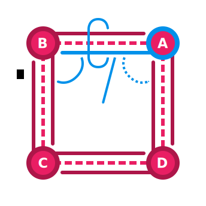

Plexus provides a flexible representation of meshes as a [half-edge
graph](https://en.wikipedia.org/wiki/doubly_connected_edge_list) via the `graph`
module and `MeshGraph` type. Graphs can store arbitrary geometric data
associated with any topological structure. Unlike iterator expressions and
buffers, graphs provide efficient traversals and complex manipulation of meshes.

!!! note
    Plexus refers to _half-edges_ as _arcs_. This borrows from graph theory,
    where _arc_ typically refers to a directed adjacency.

`MeshGraph`s can be created in various ways, including from [raw
buffers](../buffers) and [iterator expressions](../generators).

```rust
// Create a graph of a two-dimensional quadrilateral from raw buffers.
let mut graph = MeshGraph::<Point2<N64>>::from_raw_buffers(
    vec![Tetragon::new(0usize, 1, 2, 3)],
    vec![(0.0, 0.0), (1.0, 0.0), (1.0, 1.0), (0.0, 1.0)],
)
.unwrap();

// Create a graph with positional data from a unit cube.
let mut graph = Cube::new()
    .polygons::<Position<Point3<N64>>>()
    .collect<MeshGraph<Point3<N64>>>();
```

## Representation

A `MeshGraph` is conceptually composed of _vertices_, _arcs_, _edges_, and
_faces_. The figure below summarizes the connectivity in a `MeshGraph`.



Arcs are directed and connect vertices. An arc that is directed toward a vertex
$A$ is an _incoming arc_ with respect to $A$. Similarly, an arc directed away
from such a vertex is an _outgoing arc_. Every vertex is associated with exactly
one _leading arc_, which is always an outgoing arc. The vertex toward which an
arc is directed is the arc's _destination vertex_ and the other is its _source
vertex_.

Every arc is paired with and connected to an _opposite arc_ with an opposing
direction. Given an arc from a vertex $A$ to a vertex $B$, that arc will have an
opposite arc from $B$ to $A$. Such arcs are typically notated
$\overrightarrow{AB}$ and $\overrightarrow{BA}$. Together, these arcs form an
_edge_, which is not directed. An edge and its two arcs are together called a
_composite edge_.

Arcs are connected to their neighbors, known as _next_ and _previous arcs_. A
traversal along a series of arcs is a _path_. The path formed by traversing from
an arc to its next arc and so on is a _ring_. When a face is present within a
ring, the arcs will refer to that face and the face will refer to exactly one of
the arcs in the ring (its leading arc). An arc with no associated face is known
as a _boundary arc_. If either of an edge's arcs is a boundary arc, then that
edge is a _boundary edge_.

A path is _closed_ if it forms a loop and is _open_ if it terminates. Rings
implicitly form a loop and are therefore always closed. Paths may be notated
using _sequence_ or _set notation_ and both forms are used to describe rings and
faces.

Sequence notation is formed from the ordered sequence of vertices that a path
traverses, including the source vertex of the first arc and the destination
vertex of the last arc. Set notation is similar, but is implicitly closed and
only includes the ordered and unique set of vertices traversed by the path. An
open path over vertices $A$, $B$, and $C$ is notated as a sequence
$\overrightarrow{(A,B,C)}$. A closed path over vertices $A$, $B$, and $C$
includes the arc $\overrightarrow{CA}$ and is notated as a sequence
$\overrightarrow{(A,B,C,A)}$ or a set $\overrightarrow{\{A,B,C\}}$. This
notation may also be used to notate arcs, but arcs typically use the shorthand
notation shown above.

Together with vertices and faces, the connectivity of arcs allows for efficient
traversals of topology. For example, it becomes trivial to find neighboring
topologies, such as the faces that share a given vertex or the neighboring faces
of a given face.

!!! warning
    The `MeshGraph` data structure has some limitations. With few exceptions,
    only [orientable](https://en.wikipedia.org/wiki/orientability) compact
    [manifolds](https://en.wikipedia.org/wiki/surface_(topology)) can be
    represented. Unorientable manifolds such as [Möbius
    strips](https://en.wikipedia.org/wiki/m%C3%B6bius_strip) and non-manifold
    structures such as singularities and edge-fans cannot be modeled using
    `MeshGraph`.

`MeshGraph`s store topological data using associative collections and mesh data
is accessed using keys into this storage. Keys are exposed as strongly typed and
opaque values, which can be used to refer to a topological structure.

## Geometry

`MeshGraph` exposes a type parameter that determines the representation of
geometry in a graph. This type must implement the `GraphGeometry` trait, which
specifies which types are used for geometry in vertices, arcs, edges, and faces.

```rust
pub struct Vertex {
    pub position: Point3<R64>,
    pub normal: Vector3<R64>,
}

impl GraphGeometry for Vertex {
    type Vertex = Self;
    type Arc = ();
    type Edge = ();
    type Face = ();
}

let mut graph = MeshGraph::<Vertex>::new();
```

!!! note
    Most examples on this page use the `N64` and `R64` types from the
    [`decorum`](https://crates.io/crates/decorum) crate and the `Point2` and
    `Point3` types from the [`nalgebra`](https://crates.io/crates/nalgebra)
    crate for graph geometry. When the `geometry-nalgebra` feature is enabled,
    these types implement `GraphGeometry`.

The associated types specified by a `GraphGeometry` implementation determine the
type of the `geometry` field exposed by [views](../graphs/#topological-views).
When set to `()`, no geometry is present.

Geometry is vertex-based, meaning that geometric operations depend on vertex
geometry exposing some notion of positional data via the `AsPosition` trait. If
geometry does not have this property, then geometric operations will not be
available. Read more about geometric traits and spatial operations
[here](../geometry).

## Topological Views

`MeshGraph`s expose _views_ over their topological structure (vertices, arcs,
edges, and faces). Views are obtained using keys or iteration and behave
similarly to references. They provide the primary API for interacting with a
`MeshGraph`'s topology and geometry. There are three types of views summarized
below:

| Type      | Traversal | Exclusive | Geometry  | Topology  |
|-----------|-----------|-----------|-----------|-----------|
| Immutable | Yes       | No        | Immutable | Immutable |
| Mutable   | Yes       | Yes       | Mutable   | Mutable   |
| Orphan    | No        | No        | Mutable   | N/A       |

_Immutable_ and _mutable views_ behave similarly to references: immutable views
cannot mutate a graph and are not exclusive while mutable views may mutate both
the geometry and topology of a graph but are exclusive. This example uses a view
to traverse a graph:

```rust hl_lines="15 16 17 18 19 20"
type E3 = Point3<N64>;

// Create a graph with positional and normal data from a unit cube.
let cube = Cube::new();
let mut graph = primitive::zip_vertices((
    cube.polygons::<Position<E3>>(),
    cube.polygons::<Normal<E3>>(),
))
.map_vertices(|(position, normal)| Vertex::new(position, normal))
.collect::<MeshGraph<Vertex>>();

// Get a view of a face and its opposite face.
let face = graph.faces().nth(0).expect("cube");
let opposite = face
    .into_arc()
    .into_opposite_arc()
    .into_next_arc()
    .into_next_arc()
    .into_opposite_arc()
    .into_face()
    .expect("cube");
```

_Orphan views_ are similar to mutable views in that they may mutate the geometry
of a graph, but they do not have access to the topology of a graph. Because they
do not know about other vertices, arcs, etc., orphan views cannot traverse a
graph in any way. These views are most useful for modifying the geometry of a
graph and, unlike mutable views, are not exclusive. Iterators over topological
structures in a graph sometimes emit orphan views.

```rust hl_lines="7 8 9"
// Create a graph with positional data from a UV-sphere.
let mut graph = UvSphere::new(8, 8)
    .polygons::<Position<Point3<f64>>>()
    .collect_with_indexer::<MeshGraph<Point3<f64>>, _>(LruIndexer::default());

// Scale the position data in all vertices.
for mut vertex in graph.vertex_orphans() {
    vertex.geometry *= 2.0;
}
```

Immutable and mutable views are both represented by view types, such as
`FaceView`. Orphan views are represented by orphan view types, such as
`FaceOrphan`.

## Traversals

Topological views can be used to traverse a graph. Traversals are an important
feature of graphs that are not supported by iterator expressions or buffers.
Most traversals involve some notion of adjacency, but `MeshGraph` also provides
categorical traversals.

### One-to-One

Conversions and accessors provide one-to-one traversals from one topological
structure to another. Conversions consume a view and emit another view while
accessors borrow a view and use that borrow to produce another view. Accessors
only expose immutable views with a limited lifetime while conversions expose
views with the same lifetime and mutability as the source view.

```rust
// Get a mutable view of a vertex in a graph.
let vertex = graph.vertex_mut(key).unwrap();

let arc = vertex.into_outgoing_arc(); // Consumes `vertex`. `arc` is mutable.
let opposite = arc.opposite_arc(); // Borrows `arc`. `opposite` is immutable.
```

Conversions and accessors are distinguished using standard Rust naming
conventions. For example, `into_outgoing_arc` is consuming and `outgoing_arc` is
borrowing; both traverse from a vertex to its outgoing arc.

!!! note
    It is not possible to perform [topological
    mutations](../graphs/#topological-mutations) using a view obtained via a
    borrowing traversal, because these views are always
    [immutable](../graphs/#topological-views).

### One-to-Many

A _circulator_ is a type of iterator that provides a one-to-many traversal that
examines all of the immediate neighbors of a topological structure. For example,
the face circulator of a vertex yields all faces that share that vertex in
order.

```rust
for face in vertex.neighboring_faces() {
    for arc in face.interior_arcs() {
        // ...
    }
}
```

Circulators generally begin iteration from a [leading
arc](../graphs/#representation) and then traverse topology in a deterministic
order from that arc. Because mutability requires orphan views, only the geometry
of immediate neighbors can be mutated using circulators.

```rust
for mut face in vertex.neighboring_face_orphans() {
    face.geometry = Color4::white();
}
```

_Search traversals_ visit all connected topological structures with some notion
of adjacency. Both vertices and faces can be traversed in this way to perform
searches using breadth- and depth-first ordering.

```rust
if let Some(vertex) = vertex
    .traverse_by_depth()
    .find(|vertex| vertex.geometry == target)
{
    // ...
}
```

!!! warning
    It is possible for vertices and faces to be _disjoint_, meaning that they do
    not share a path with all other vertices or faces. Therefore, these
    traversals are only exhaustive with respect to the topologically connected
    group with which the initiating view is associated; they do not necessarily
    visit every vertex or face that is a member of a particular graph.

`MeshGraph`s also directly expose topological structures via iterators, but
without a deterministic ordering. These categorical iterators are always
exhaustive, and visit all topological structures in a graph regardless of their
connectivity.

```rust
let (graph, _) = MeshGraph::<Point3<f64>>::from_ply(
    PositionEncoding::default(),
    File::open("flower.ply").unwrap(),
)
.unwrap();

// Modify the geometry of every vertex.
for mut vertex in graph.vertex_orphans() {
    vertex.geometry *= 2.0;
}
```

Mutable iterators (including circulators) emit orphan views, because mutable
views require exclusive access. To mutate topology using multiple mutable views,
use an immutable circulator to collect the keys of the target topology and then
lookup each mutable view using those keys.

```rust hl_lines="7 8 9 10"
// Create a graph with positional data from a unit cube.
let mut graph = Cube::new()
    .polygons::<Position<Point3<N64>>>()
    .collect::<MeshGraph<Point3<N64>>>();

// Collect the keys of the faces in the graph.
let keys = graph
    .faces()
    .map(|face| face.key())
    .collect::<ArrayVec<[_; 6]>>();
for key in keys {
    // Get a mutable face view for each key.
    // Poke each face and translate the centroid along the face's normal.
    let _ = graph.face_mut(key).expect("independent").poke_with_offset(0.5);
}
```

!!! note
    Mutations may be _dependent_ and invalidate keys. Some mutations may not be
    able to operate on the given set of keys as trivially as seen in the example
    above.

### Rebinding

Topological views pair a key with a reference to the underlying storage of a
graph. Given a view, it is possible to _rebind_ the view to construct a new view
using the same underlying storage. It is even possible to rebind between
different topological structures, such as rebinding a `FaceView` into a
`VertexView`.

Rebinding is useful for fallible traversals that maintain mutability. A mutable
view can be used to look up a key and, if such a key is found, be rebound into
that topology. This avoids performing the same traversal more than once in order
to query and then convert or mutate.

```rust
let face = graph.face_mut(key).unwrap();
// Find a face along a boundary. If no such face is found, continue to use the
// initiating face.
let mut face = {
    let key = face
        .traverse_by_depth()
        .find(|face| {
            face.interior_arcs()
                .map(|arc| arc.into_opposite_arc())
                .any(|arc| arc.is_boundary_arc())
        })
        .map(|face| face.key());
    if let Some(key) = key {
        face.rebind(key).unwrap() // Rebind into the boundary face.
    }
    else {
        face // Use the initiating face.
    }
};
```

Rebinding can also be useful for code that only operates on topological views
and does not have access to the associated `MeshGraph`, because it allows
arbitrary access to the graph's structure.

## Topological Mutations

Mutable views expose topological mutations that alter the structure of a graph.
These operations are always consuming, because they often invalidate the view
that initiates them.

Most mutations return a view over a modified or newly inserted topological
structure that can be used to further traverse the graph. For example, splitting
an arc $\overrightarrow{AB}$ returns a vertex $M$ that subdivides the composite
edge. The leading arc of $M$ is $\overrightarrow{MB}$ and is a part of the same
ring as the initiating arc.

```rust
let vertex = arc.split_at_midpoint(); // Consumes `arc`. `vertex` is mutable.
```

It is possible to downgrade mutable views into immutable views using `into_ref`.
This can be useful when performing topological mutations, as it allows for any
number of traversals immediately after the mutation is performed.

```rust hl_lines="2"
// Split an arc and use `into_ref` to get an immutable view.
let vertex = arc.split_at_midpoint().into_ref();

// `vertex` is immutable and implements `Copy`.
let source = vertex
    .into_outgoing_arc()
    .into_previous_arc()
    .into_source_vertex();
let destination = vertex.into_outgoing_arc().into_destination_vertex();
let span = (source, destination);
```

Graphs also provide topological mutations that may operate over an entire graph.

```rust hl_lines="10"
type E3 = Point3<N64>;

let cube = Cube::new();
let mut graph = primitive::zip_vertices((
    cube.polygons::<Position<E3>>(),
    cube.polygons::<Normal<E3>>(),
))
.collect::<MeshGraph<Vertex>>();

graph.triangulate(); // Triangulates all faces in the graph.
```

Graphs may contain _disjoint sub-graphs_, which are topological groups that
cannot reach each other. It is possible to split a graph into sub-graphs.

```rust
// Create a graph of two squares sharing a single edge.
let mut graph = MeshGraph::<Point2<f64>>::from_raw_buffers(
    vec![Tetragon::new(0usize, 1, 2, 3), Tetragon::new(0, 3, 4, 5)],
    vec![
        (0.0, 0.0),
        (1.0, 0.0),
        (1.0, 1.0),
        (0.0, 1.0),
        (-1.0, 1.0),
        (-1.0, 0.0),
    ],
)
.unwrap();

// Find the shared edge and a get a path along one of its arcs.
let key = graph
    .edges()
    .find(|edge| !edge.is_boundary_edge())
    .map(|edge| edge.key())
    .unwrap();
let path = graph.edge_mut(key).unwrap().into_arc().into_path();

// Split the graph into two disjoint sub-graphs.
let _ = MeshGraph::split_at_path(path).unwrap();
let graphs = graph.into_disjoint_subgraphs();
```

Topological mutations expose spatial functions for types that implement
geometric traits, such as `split_at_midpoint`. Views also expose purely
topological functions, which can always be used (even if the geometry is
non-spatial).

```rust hl_lines="16"
pub enum Weight {}

impl GraphGeometry for Weight {
    type Vertex = f64;
    type Arc = ();
    type Edge = ();
    type Face = ();
}

let mut graph = MeshGraph::<Weight>::from_raw_buffers(
    vec![Trigon::new(0usize, 1, 2)],
    vec![1.0, 2.0, 0.5],
)
.expect("triangle");
let key = graph.arcs().nth(0).expect("triangle").key();
let vertex = graph.arc_mut(key).unwrap().split_with(|| 0.1);
```

In the above example, `split_with` accepts a function that returns geometry for
the subdividing vertex of the split. Similar functions exist for other
topological mutations as well, such as `poke_with`.

## Computation vs. Payload

When graph geometry implements geometric traits, views expose methods to compute
related attributes like normals and centroids.

```rust
let (graph, _) = MeshGraph::<Point3<f64>>::from_ply(
    PositionEncoding::default(),
    File::open("teapot.ply").unwrap(),
)
.unwrap();

// Computes the centroid of the face.
let centroid = graph.faces().nth(0).unwrap().centroid();
```

These computations are based on the positional data in vertices. However, it is
also possible to include these attributes in the geometry (payload) of a graph
and assign arbitrary values as needed. For example, it is sometimes desirable to
establish vertex normals independently of surrounding face or edge geometry.

```rust
pub struct Vertex {
    pub position: Point3<R64>,
    pub normal: Vector3<R64>,
}

impl GraphGeometry for Vertex {
    type Vertex = Self;
    type Arc = ();
    type Edge = ();
    type Face = ();
}

let mut graph = Cube::new()
    .polygons::<Position<Point3<N64>>>()
    .map_vertices(|position| Vertex {
        position,
        normal: Unit::x(),
    })
    .collect<MeshGraph<Vertex>>();

// Write arbitrary data to the payload.
let mut vertex = graph.vertex_orphans().nth(0).unwrap();
vertex.geometry.normal = Unit::z();
```

The above example uses the `Vertex` type to store a position and normal in each
vertex. This is distinct from computed attributes, as this normal is arbitrary
and is not recomputed when it is accessed. Applications may choose either
approach, though computation is typically preferable.

## Generic Programming

The `graph` module provides traits that express the geometric capabilities of a
`MeshGraph`. These can be used to write generic code that requires particular
geometric operations, such as computing edge midpoints. This example subdivides
a face in a mesh by splitting arcs at their midpoints:

```rust hl_lines="3 4"
pub fn circumscribe<G>(face: FaceView<&mut MeshGraph<G>, G>) -> FaceView<&mut MeshGraph<G>, G>
where
    G: EdgeMidpoint + GraphGeometry,
    G::Vertex: AsPosition,
{
    // Split each edge, stashing the vertex key and moving to the next arc.
    let arity = face.arity();
    let mut arc = face.into_arc();
    let mut splits = SmallVec::<[_; 4]>::with_capacity(arity);
    for _ in 0..arity {
        let vertex = arc.split_at_midpoint();
        splits.push(vertex.key());
        arc = vertex.into_outgoing_arc().into_next_arc();
    }
    // Split faces along the vertices from each arc split.
    let mut face = arc.into_face().unwrap();
    for (a, b) in splits.into_iter().perimeter() {
        face = face.split(ByKey(a), ByKey(b)).unwrap().into_face().unwrap();
    }
    // Return the terminating face of the decomposition.
    face
}
```

These traits avoid the need to specify very complex type bounds, but it is also
possible to express type bounds directly using traits from the
[`decorum`](https://crates.io/crates/decorum) and
[`theon`](https://crates.io/crates/theon) crates.

The following example expresses type bounds for a function that computes the
area of faces in two-dimensional graphs:

```rust hl_lines="4 5"
pub fn area<G>(face: FaceView<&MeshGraph<G>, G>) -> Scalar<VertexPosition<G>>
where
    G: GraphGeometry,
    G::Vertex: AsPosition,
    VertexPosition<G>: EuclideanSpace + FiniteDimensional<N = U2>,
{
    // ...
}
```

Some topological views are strongly related and have common semantics. These
views can be abstracted via traits. The `Edgoid` trait is implemented by
`ArcView` and `EdgeView` and allows either type to be converted into an arc or
edge that forms a composite edge. Similarly, the `Ringoid` trait is implemented
by `FaceView` and `RingView` and provides access to either type's interior arcs.
